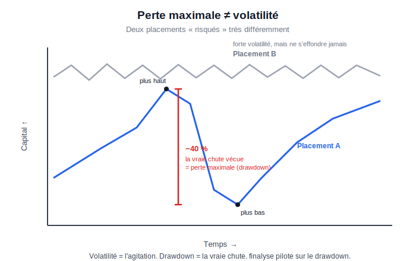
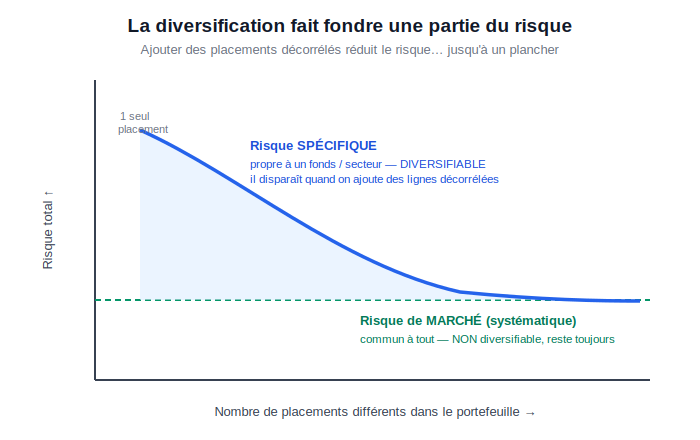
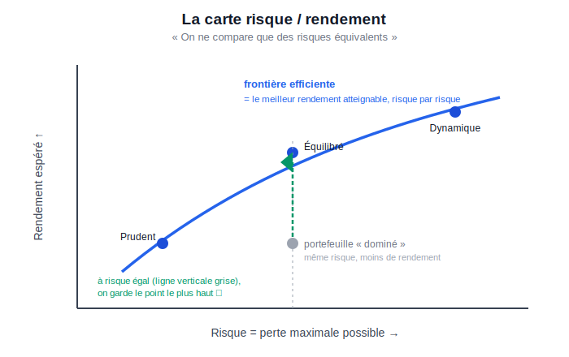

# finalyse — Le modèle et le sourcing des données

Documentation de référence du moteur d'optimisation de portefeuille **finalyse**.
Niveaux de lecture :

- **[Synthèse](#synthèse--le-modèle-en-7-points)** : le modèle en 7 points, pour aller à l'essentiel.
- **[Fondements théoriques](#fondements-théoriques--lesprit-du-modèle)** : l'esprit du modèle et son ancrage dans la littérature financière (Markowitz, diversification, mesures de risque, drawdown).
- **[Partie A — Niveau simple](#partie-a--niveau-simple-novice)** : sans bagage financier, pour comprendre *ce que fait* le modèle et *pourquoi*.
- **[Partie B — Niveau avancé](#partie-b--niveau-avancé-technique)** : la mécanique quantitative exacte (formules, algorithmes, garde-fous).
- **[Partie C — Sourcing des données](#partie-c--sourcing-des-données)** : d'où viennent les cours, comment ils sont nettoyés et convertis.
- **[Partie D — Architecture](#partie-d--architecture-carte-des-modules)**, **[E — Lancer](#partie-e--comment-lancer)**, **[F — Pièges](#partie-f--pièges-connus)**, **[G — Limites](#partie-g--limites-et-suite)**.

> **En une phrase.** finalyse construit des portefeuilles qui cherchent d'abord à **limiter la perte maximale** (le « drawdown ») plutôt qu'à lisser l'agitation quotidienne, sur trois enveloppes fiscales françaises (CTO, PEA, assurance-vie), avec tous les cours ramenés en euros et une validation honnête qui refuse les portefeuilles trop beaux pour être vrais.

---

## Synthèse — le modèle en 7 points

1. **Le problème.** Bien répartir son épargne pour **résister aux crises**, pas seulement pour lisser le quotidien.
2. **La mesure de risque.** On mesure le risque par la **perte maximale** (drawdown / CDaR), pas par la volatilité — parce que c'est ce que *vit* l'épargnant (aversion à la perte, principe « éviter le désastre d'abord »).
3. **La diversification.** On répartit sur des placements **peu corrélés** pour faire disparaître le risque « spécifique » (évitable), et on ne garde que le risque de marché (irréductible).
4. **La robustesse.** On n'essaie **pas de deviner les rendements futurs** (trop fragile) : on n'optimise que le risque, avec des méthodes stables (HRP, covariance shrinkée).
5. **Trois enveloppes.** Un portefeuille par enveloppe (CTO / PEA / assurance-vie), **tout converti en euros** (le change est un risque à part entière).
6. **L'honnêteté.** Une **validation hors-échantillon** rejette les portefeuilles trop beaux pour être vrais (elle a écarté l'option « drawdown minimal » sur 2 des 3 enveloppes).
7. **Le fil rouge.** *On ne compare que des risques équivalents* — à perte-max égale, à devise égale, sur une histoire incluant les mêmes crises.

**Ce que ça produit :** pour chaque enveloppe, une **répartition recommandée** (+ variantes et profils), avec ses performances passées **et** hors-échantillon (`result_portfolios.json`).

---

## Fondements théoriques — l'esprit du modèle

Le modèle n'est pas un empilement d'astuces : il prend position dans un débat scientifique vieux de 70 ans sur *comment mesurer et maîtriser le risque d'un portefeuille*. Cette section explique **pourquoi** chaque choix, en le rattachant à la littérature.

### 1. Le cadre fondateur : la théorie moderne du portefeuille (Markowitz)

Tout part de **Markowitz (1952, *Portfolio Selection*, Journal of Finance)** — travail qui lui vaudra le prix Nobel 1990. Son intuition rompt avec l'analyse titre-par-titre : **le risque d'un portefeuille n'est pas la somme des risques de ses lignes**. Deux actifs risqués mais peu corrélés se compensent partiellement ; ce qui compte, ce sont les **covariances**, pas les variances isolées.

De là naît la **frontière efficiente** : l'ensemble des portefeuilles offrant le **rendement maximal pour un niveau de risque donné** (ou le risque minimal pour un rendement donné). Un portefeuille « sous » la frontière est dominé : on peut faire mieux sans prendre plus de risque. C'est le socle conceptuel de finalyse — sauf qu'on remplacera l'axe de risque (voir §3).

### 2. Diversification : risque diversifiable vs non-diversifiable

Le **MEDAF/CAPM (Sharpe 1964 ; Lintner 1965 ; Mossin 1966)** formalise une décomposition centrale du risque total d'un actif :

- **Risque spécifique (idiosyncratique, *diversifiable*)** : propre à un émetteur/secteur (un plan social, une fraude, une sécheresse sur une matière première). Il **s'annule** quand on détient assez de lignes décorrélées — la diversification le fait « gratuitement » disparaître.
- **Risque systématique (de marché, *non-diversifiable*)** : commun à tous les actifs (récession, choc de taux, crise de liquidité). Aucune diversification ne l'élimine ; c'est le seul risque **rémunéré** à l'équilibre (prime de risque).

**Conséquence directe pour finalyse** : concentrer un portefeuille sur une ligne « miracle » (ex. un ETC *Live Cattle* au parcours lisse) revient à se faire payer pour du risque *spécifique* que la théorie dit non-rémunéré et évitable — c'est précisément le piège que le nettoyage d'univers et la validation hors-échantillon débusquent (voir Partie F). À l'inverse, on récompense la **décorrélation** : c'est le rôle de **HRP (López de Prado 2016)**, qui construit la diversification par un *clustering hiérarchique des corrélations*, sans l'instabilité de l'inversion de matrice de Markowitz (voir §4).

### 3. Pourquoi PAS la variance/volatilité comme mesure de risque

Markowitz mesure le risque par la **variance** (≈ volatilité). C'est mathématiquement commode mais critiquable, et finalyse s'en écarte pour quatre raisons documentées :

1. **La volatilité est symétrique** : elle pénalise autant les hausses que les baisses. Or l'investisseur ne « craint » pas de gagner. Markowitz lui-même (1959) proposait la **semi-variance** ; le **ratio de Sortino** en découle. On veut mesurer le *mauvais* côté.
2. **Les rendements ne sont pas gaussiens** : queues épaisses, asymétrie (**Mandelbrot 1963 ; Fama 1965**). La variance sous-estime les événements extrêmes — exactement ceux qui ruinent l'épargnant.
3. **La psychologie réelle** : l'**aversion à la perte (Kahneman & Tversky 1979, *Prospect Theory*)** montre que la douleur d'une perte pèse ~2× le plaisir d'un gain équivalent. Ce que vit l'investisseur, ce n'est pas l'écart-type — c'est **la chute depuis le dernier sommet**.
4. **L'optimisation de Markowitz est instable** : minuscule erreur d'estimation des rendements espérés → poids qui explosent (**Michaud 1989, « The Markowitz Optimization Enigma » ; Best & Grauer 1991**). D'où le choix de méthodes *robustes* (§4).

### 4. La perte maximale (drawdown) : pourquoi cette métrique

finalyse pilote par le **drawdown** — la chute du plus haut au plus bas de la courbe de capital. Justifications théoriques :

- **Le vécu et l'asymétrie de récupération** : une perte de −50 % exige +100 % pour revenir à l'équilibre. Le drawdown est *dépendant du chemin* (path-dependent), là où la variance est agnostique à l'ordre des rendements. C'est la métrique qui déclenche la **capitulation** (vente au pire moment).
- **Le principe « safety-first » (Roy 1952, *Safety First and the Holding of Assets*)** : contemporain de Markowitz, Roy pose que l'investisseur cherche **d'abord à éviter le désastre** (minimiser la probabilité de tomber sous un seuil de ruine) avant d'optimiser le rendement. Le drawdown est l'expression naturelle de cette priorité.
- **CDaR, une généralisation cohérente (Chekhlov, Uryasev & Zabarankin 2005, *Drawdown Measure in Portfolio Optimization*)** : plutôt que le seul *maximum* drawdown (fragile, dicté par un unique accident), le **Conditional Drawdown at Risk** moyenne les pires drawdowns au-delà d'un quantile α. Il est **convexe et optimisable en programme linéaire** — d'où son emploi comme objectif.
- **Filiation avec les mesures cohérentes de risque** : le CDaR est au drawdown ce que le **CVaR / Expected Shortfall (Rockafellar & Uryasev 2000)** est à la perte. Or **Artzner, Delbaen, Eber & Heath (1999, *Coherent Measures of Risk*)** ont montré que la **VaR n'est pas cohérente** (elle peut pénaliser la diversification !), tandis que CVaR/CDaR le sont (sous-additivité). On optimise donc une mesure *mathématiquement saine*.
- **Le juge de paix : le ratio de Calmar / MAR (Young 1991)** = rendement annualisé / max drawdown. C'est l'analogue du Sharpe, mais avec le risque mesuré comme perte maximale — la boussole de reporting de finalyse.

### 5. Robustesse : ne pas sur-optimiser le passé

Optimiser *trop finement* sur l'historique produit des portefeuilles magnifiques *in-sample* et décevants ensuite — le **surajustement de backtest (Bailey & López de Prado 2014, *The Deflated Sharpe Ratio* ; « Pseudo-Mathematics and Financial Charlatanism »)**. Parades intégrées :

- **Aucune estimation de rendement espéré** pour les portefeuilles cœur (`min_cdar`, HRP) : on n'optimise que le risque, la partie la plus stable à estimer.
- **Covariance shrinkée (Ledoit & Wolf 2004, « Honey, I Shrunk the Sample Covariance Matrix »)** : réduit le bruit d'estimation qui déstabilise Markowitz.
- **Validation walk-forward hors-échantillon** avec **contrôle d'honnêteté** (drawdown réalisé OOS vs promesse in-sample) : c'est le test décisif qui, sur le run réel, a fait rejeter le `min_cdar` surajusté sur 2 des 3 enveloppes.

### 6. « On ne compare que des risques équivalents »

Principe méthodologique cardinal, hérité de la frontière efficiente et de la comparaison ajustée du risque (**Sharpe 1966**) : **une comparaison n'a de sens qu'à risque égal (ou rendement égal)**. Un fonds « plus rentable » mais deux fois plus risqué n'est pas « meilleur » — il est ailleurs sur la frontière. finalyse applique ce principe à quatre niveaux :

1. **Profils à perte-max cible** (prudent −10 %, équilibré −20 %, dynamique −35 %) : on ne compare que des allocations partageant **le même budget de drawdown**.
2. **Enveloppes séparées** (CTO / PEA / AV) : on ne mélange pas des univers aux règles fiscales et structurelles différentes.
3. **Conversion en euros** : un rendement en livres et un rendement en euros ne sont **pas la même unité** pour un investisseur euro — les comparer sans convertir, c'est comparer des risques non-équivalents (le change est un risque à part entière ; voir Partie B.3).
4. **Fenêtre commune couvrant les mêmes crises** : comparer un ETF né en 2021 (jamais éprouvé par 2008) à un fonds de 2005 est un **biais de récence** — on exige une histoire partagée incluant les krachs.

### 7. Synthèse : l'ADN du modèle

finalyse = **le cadre de Markowitz (diversification par les covariances) + une mesure de risque qui colle au vécu (drawdown/CDaR plutôt que variance) + la robustesse (pas d'estimation de rendement, covariance shrinkée, HRP, validation OOS) + la discipline de ne comparer qu'à risque équivalent (profils, enveloppes, euros, fenêtre commune).** Chaque brique répond à une faiblesse identifiée de l'approche variance-espérance classique.

### Références

- Artzner P., Delbaen F., Eber J-M., Heath D. (1999), *Coherent Measures of Risk*, Mathematical Finance 9(3).
- Bailey D., López de Prado M. (2014), *The Deflated Sharpe Ratio*, Journal of Portfolio Management.
- Best M., Grauer R. (1991), *On the Sensitivity of Mean-Variance-Efficient Portfolios…*, Review of Financial Studies.
- Chekhlov A., Uryasev S., Zabarankin M. (2005), *Drawdown Measure in Portfolio Optimization*, Int. J. of Theoretical and Applied Finance 8(1).
- Fama E. (1965), *The Behavior of Stock-Market Prices*, Journal of Business.
- Kahneman D., Tversky A. (1979), *Prospect Theory: An Analysis of Decision under Risk*, Econometrica.
- Ledoit O., Wolf M. (2004), *Honey, I Shrunk the Sample Covariance Matrix*, Journal of Portfolio Management.
- Lintner J. (1965), *The Valuation of Risk Assets…*, Review of Economics and Statistics.
- López de Prado M. (2016), *Building Diversified Portfolios that Outperform Out of Sample*, Journal of Portfolio Management (HRP).
- Mandelbrot B. (1963), *The Variation of Certain Speculative Prices*, Journal of Business.
- Markowitz H. (1952), *Portfolio Selection*, Journal of Finance 7(1) ; (1959) *Portfolio Selection: Efficient Diversification of Investments*.
- Michaud R. (1989), *The Markowitz Optimization Enigma: Is 'Optimized' Optimal?*, Financial Analysts Journal.
- Rockafellar R.T., Uryasev S. (2000), *Optimization of Conditional Value-at-Risk*, Journal of Risk.
- Roy A.D. (1952), *Safety First and the Holding of Assets*, Econometrica.
- Sharpe W. (1964), *Capital Asset Prices…*, Journal of Finance ; (1966) *Mutual Fund Performance*, Journal of Business.
- Young T. (1991), *Calmar Ratio: A Smoother Tool*, Futures Magazine.

---

## Partie A — Niveau simple (novice)

### Trois schémas pour tout comprendre

Ces trois images résument l'essentiel du modèle. Aucun calcul : juste les idées.

**① Perte maximale ≠ volatilité — pourquoi on regarde la vraie chute**



> Deux placements peuvent sembler « risqués » sans l'être de la même façon. Le placement **B** est très *agité* (il monte et descend sans cesse) mais ne s'effondre jamais : forte **volatilité**, faible danger réel. Le placement **A** est plus calme au jour le jour mais **plonge de −40 %** : c'est la **perte maximale** (le « drawdown »), la chute que l'épargnant ressent vraiment et qui pousse à vendre au pire moment. finalyse pilote sur cette chute-là, pas sur l'agitation.

**② La diversification fait fondre une partie du risque**



> Quand on ajoute des placements **différents et peu liés entre eux**, une partie du risque **disparaît toute seule** : c'est le risque **spécifique** (propre à un fonds ou un secteur — une fraude, une sécheresse). Mais il reste un **plancher** qu'aucune diversification n'enlève : le risque **de marché** (une récession touche tout le monde). Moralité : parier gros sur *une* ligne « miracle », c'est prendre un risque évitable et non récompensé.

**③ La carte risque / rendement — « on ne compare qu'à risque équivalent »**



> Chaque portefeuille est un point : à droite = plus risqué, en haut = plus rentable. La **frontière efficiente** (courbe bleue) est la « meilleure route » : pour un risque donné, elle donne le rendement le plus élevé possible. Un portefeuille **sous** la courbe est « dominé » — on peut faire mieux **sans prendre plus de risque** (flèche verte, à risque égal). C'est la règle d'or : *on ne compare deux placements qu'à risque équivalent*. Les profils **Prudent / Équilibré / Dynamique** sont trois points de cette courbe, du moins au plus exposé.

### A.1 À quoi ça sert

finalyse répond à une question : *« Comment répartir mon argent entre plusieurs fonds pour bien dormir la nuit ? »*
Il prend un catalogue de fonds/ETF réels, regarde comment ils se sont comportés depuis ~2008, et propose une **répartition** (« mets 35 % ici, 20 % là… ») qui a historiquement le mieux résisté aux crises pour un niveau de rendement donné.

### A.2 L'idée clé : piloter la perte, pas l'agitation

La plupart des outils grand public mesurent le risque par la **volatilité** (à quel point ça bouge tous les jours). Problème : un placement peut peu bouger au jour le jour mais s'effondrer lentement de −40 % sur deux ans. La volatilité ne le voit pas.

finalyse pilote par le **drawdown** : *« quelle est la pire chute, du plus haut au plus bas, que j'aurais subie ? »* C'est ce que ressent vraiment l'épargnant. Plus précisément on utilise le **CDaR** (« Conditional Drawdown at Risk ») : la moyenne des pires chutes, pas seulement la pire unique — plus robuste qu'un accident isolé.

> Analogie : la volatilité, c'est la nervosité d'un trajet en voiture. Le drawdown, c'est *à quel point tu es descendu dans le ravin*. On optimise pour éviter le ravin.

### A.3 Les 3 enveloppes (CTO / PEA / AV)

En France, où on loge son argent change les fonds accessibles et la fiscalité. finalyse produit **un portefeuille par enveloppe**, car on ne compare que ce qui est comparable :

| Enveloppe | Ce que c'est | Univers de fonds |
|---|---|---|
| **CTO** | Compte-titres ordinaire | ETF cotés (Bourse de Paris, Francfort, Londres) |
| **PEA** | Plan d'épargne en actions (avantage fiscal, actions surtout) | ETF éligibles PEA (Amundi/Lyxor) |
| **AV** | Assurance-vie | Unités de compte = fonds/OPCVM par code ISIN |

### A.4 Pourquoi tout ramener en euros

Un fonds britannique est coté en **livres sterling**. Si la livre chute de 20 % face à l'euro, un épargnant français perd 20 % *même si le fonds n'a pas bougé*. Beaucoup d'outils l'ignorent et calculent le risque dans la devise d'origine — ils **sous-estiment** donc le vrai risque.

finalyse convertit **systématiquement chaque cours en euros** avant de calculer quoi que ce soit. C'est loin d'être un détail : sur notre catalogue d'assurance-vie, **26 fonds sur 32** étaient dans une autre devise (livre, couronne, dollar). Une fois le risque mesuré en euros, le modèle **écarte spontanément** les fonds britanniques dont la « stabilité » n'était qu'une illusion de change.

### A.5 Comment on évite de se raconter des histoires (le test OOS)

Un optimiseur peut trouver une répartition qui *aurait été* magnifique dans le passé… parce qu'elle colle par hasard à un fonds chanceux. C'est du **surajustement** : beau sur le papier, décevant en vrai.

finalyse se teste comme un élève à qui on cache la moitié du sujet : on calcule les poids sur les **premières années**, puis on regarde comment ils se seraient comportés sur les **années suivantes qu'il n'avait pas vues** (« hors-échantillon », OOS). Si la perte réelle explose par rapport à la promesse, on **rejette** ce portefeuille et on prend une méthode plus prudente (HRP, voir partie B). Concrètement, ce garde-fou a fait basculer 2 des 3 enveloppes vers l'option robuste.

### A.6 Les frais

Deux couches de frais :
1. **Les frais du fonds** (frais de gestion de l'OPCVM) : déjà retirés du cours qu'on récupère. Rien à faire.
2. **Les frais du contrat** (assurance-vie seulement) : l'assureur prélève ~0,6 à 1 %/an *en plus*, sur la valeur. finalyse les **déduit** pour l'AV (0,8 %/an par défaut), sinon la comparaison AV vs CTO/PEA serait faussée. Effet mesuré : ~−0,9 point de rendement annuel.

### A.7 Ce que ça produit

Pour chaque enveloppe, un fichier structuré (`result_portfolios.json`) contenant : la **répartition recommandée**, plusieurs variantes (drawdown minimal, « le plus décorrélé », profils prudent/équilibré/dynamique), les performances passées **et** hors-échantillon, et la liste des fonds retenus (nom, ISIN, devise). C'est le « contrat » que consommeront ensuite le tableau de bord et l'app bWealthy.

---

## Partie B — Niveau avancé (technique)

Convention générale : on travaille en **rendements hebdomadaires simples** (`W-FRI`), colonnes = actifs, sur la **fenêtre commune** où toutes les séries existent. Rendements simples car le rendement d'un portefeuille est linéaire en simple (`w·r`), tandis que le drawdown se calcule sur l'équité composée.

### B.1 Formulation CDaR en programme linéaire

Cœur mathématique (`optimize.py`, d'après **Chekhlov, Uryasev, Zabarankin 2005**). Le CDaR est posé en **programme linéaire** résolu par `scipy.linprog` (HiGHS). Variables :

```
x = [ w(n) | u(T) | zeta(1) | z(T) ]
  w    : poids des n actifs
  u_k  : plus-haut courant (peak) du cumul, ≥ 0
  zeta : seuil type VaR sur le drawdown (libre)
  z_k  : excès de drawdown au-delà de zeta, ≥ 0
```

Le CDaR de l'optimiseur porte sur le **cumul non composé** `y_k = Σ_{t≤k} w·r_t` (indispensable pour rester linéaire). Contraintes structurelles (`_cdar_blocks`) :

- **(a)** `peak ≥ cumul` : `C[k]·w − u_k ≤ 0`
- **(b)** `peak monotone` : `u_{k−1} − u_k ≤ 0`
- **(c)** `excès` : `u_k − C[k]·w − zeta ≤ z_k`
- **égalité** : `Σ w = 1` ; **bornes** : `0 ≤ w_i ≤ wmax`

Objectif CDaR = `zeta + 1/((1−α)·T) · Σ z_k`. Le drawdown composé « vrai » est reporté à part par `metrics.py` (écart faible en hebdo, honnêteté assumée).

### B.2 Les optimiseurs

| Fonction | Rôle | Estime un rendement ? |
|---|---|---|
| `min_cdar(returns, α, wmax)` | **Drawdown minimal.** Objectif retenu par défaut. | Non → robuste |
| `max_return_under_cdar(returns, budget, μ, …)` | Rendement max sous **contrainte** CDaR ≤ budget (pilotage à la Calmar) | Oui (μ historique, fragile) |
| `drawdown_frontier(…)` | Frontière drawdown-efficiente : rendement max sur une grille de budgets CDaR | Oui |
| `hrp(returns, wmax)` | **Hierarchical Risk Parity** (López de Prado 2016) : clustering de corrélations, pas d'inversion de matrice → robuste au bruit. « Le plus décorrélé ». | Non |
| `min_variance_lw(returns, wmax)` | Min-variance sur covariance **Ledoit-Wolf** shrinkée (repère « variance ») | Non |

Le choix produit (`portfolios.optimize_envelope`) : **`min_cdar` comme objectif principal**, `hrp` en second avis, plus la frontière et les portefeuilles par **profil de perte max cible** (prudent −10 %, équilibré −20 %, dynamique −35 %).

### B.3 Conversion EUR (`fx.py`)

- `to_eur(price, ccy, fx_provider)` : ramène une série dans l'unité du portefeuille.
- `convert(price, fx)` (pur) : `fx` = **EUR par 1 unité de devise**, réindexé sur les dates du prix puis **ffill/bfill** (report du dernier taux connu, jamais d'invention), puis `prix × fx`.
- **Point non trivial — le pence.** GBX/GBp = GBP/100. `normalize_ccy` renvoie `("GBP", 0.01)` : on divise par 100 **avant** d'appliquer le taux GBP→EUR. Sans ça, un facteur 100 fausse tout.
- **Point non trivial — la vol FX injecte du drawdown.** Un taux de change *constant* n'a **aucun** effet (il est invariant sur les rendements, simple facteur d'échelle). L'effet vient de la **volatilité** du change : un fonds plat en devise native (drawdown 0) peut afficher un drawdown de 30 % en euros si sa devise chute de 30 %. C'est exactement ce que `test_fx.py::test_fx_injects_drawdown` prouve.
- Source du taux : FOREX EODHD `{CCY}EUR.FOREX`, caché dans `data/fx/`.

### B.4 Résolution des devises (`currency.py`)

- **Le préfixe ISIN ne donne PAS la devise** (une part LU peut être libellée en USD ou GBP). Source fiable unique : le **catalogue de la place** — `exchange-symbol-list/{PLACE}` EODHD porte un champ `Currency`.
- ⚠️ L'endpoint `fundamentals/{ISIN}` renvoie **403** sur le plan courant → l'`exchange-symbol-list` est la **seule** source devise disponible.
- `build_maps(exchanges)` → `(by_isin, by_code)` ; priorité à l'ISIN (unique), puis à la première place listée. Places vérifiées : `EUFUND, XETRA, PA, LSE`. Résilient : une place indisponible est *skippée*, pas fatale.
- Piège corrigé : un ISIN vide relu du CSV devient `NaN` (float, **truthy** en Python) → helper `_s()` de coercion sûre.

### B.5 Frais d'enveloppe (`portfolios.apply_annual_fee`)

La VL EODHD (`adjusted_close`) est **déjà nette des frais internes du fonds**. On ne retranche que la **couche contrat** (AV) : `(1+r_net) = (1+r_brut)·(1−frais_hebdo)` avec `frais_hebdo = (1+f)^{1/52}−1`. Frais uniformes → décale le net sans bouleverser l'allocation relative. Défaut AV = 0,8 %/an ; 0 pour CTO/PEA (le TER de l'ETF est déjà dans le cours).

### B.6 Validation walk-forward + contrôle d'honnêteté (`backtest.py`)

`walk_forward` : estime les poids sur `train` semaines, les **fige** sur les `test` suivantes, roule (fenêtres adaptatives selon la profondeur). `honesty_check` compare le **CDaR in-sample moyen** au **max drawdown réalisé OOS moyen** :

```
ratio_realise_sur_promesse = oos_maxdd_moyen / insample_cdar_moyen
```

`optimize_envelope` calcule ce ratio pour `min_cdar` et `hrp`, puis pose la **recommandation** : `min_cdar` **seulement s'il tient** (ratio ≤ 1,4 **ET** Calmar OOS ≥ celui de HRP) ; sinon repli sur `hrp`. Résultat sur le run réel : CTO → HRP, AV → HRP, PEA → min_cdar.

### B.7 Définition des métriques (`metrics.py`)

Sur l'équité composée `eq = Π(1+r)` :

| Métrique | Définition |
|---|---|
| `max_drawdown` | `max(1 − eq/peak)`, peak = max courant |
| `cagr` | `eq[-1]^{52/T} − 1` |
| `vol_annual` | `std(r)·√52` |
| `sharpe` | `(cagr − rf)/vol` |
| `calmar` | `cagr / max_drawdown` — le juge de paix du pilotage DD |
| `cdar(α=0.95)` | moyenne des drawdowns au-delà du quantile α |

---

## Partie C — Sourcing des données

### C.1 EODHD — source principale

Plan **« EOD Historical Data – All World »**. On lit `adjusted_close` = **total return** (dividendes réinvestis), ce qui règle le piège des dividendes. Endpoint `/api/eod/{sym}` (`data_eodhd._fetch_one`). Token dans l'env `EODHD_API_TOKEN` — **jamais** en argument, log ou chat ; injecté en RAM depuis Bitwarden via `ask-secret.sh`.

Conventions de symboles :

| Type d'actif | Symbole EODHD |
|---|---|
| Action / ETF coté US | `TICKER.US` |
| ETF Francfort / Paris / Londres | `TICKER.XETRA` / `.PA` / `.LSE` |
| Fonds / UC (par ISIN) | `ISIN.EUFUND` |
| Or spot | `XAUUSD.FOREX` |
| Taux de change | `{CCY}EUR.FOREX` |

### C.2 Univers coté (CTO / PEA)

ETF cotés récupérés par ticker + place. XETRA et Euronext Paris cotent en EUR → **pas de biais de change** côté CTO/PEA (0/36 non-EUR sur le run). Les ETF **PEA** sont des wrappers synthétiques (swap) éligibles au plan, structurellement **récents** (souvent post-2014) → fenêtre PEA bornée à ~2019, sans 2008 : biais à garder en tête.

### C.3 UC d'assurance-vie (EUFUND)

Les unités de compte sont des OPCVM identifiés par **ISIN**, pas des tickers boursiers → `ISIN.EUFUND`. C'est l'univers le plus riche en devises étrangères (parts GB/SE/NO/US) et donc **celui où la conversion EUR compte le plus**.

### C.4 Taux de change (FOREX)

`{CCY}EUR.FOREX` via le même endpoint `/eod`. Caché dans `data/fx/{CCY}EUR.csv` (« chaque requête nourrit la base »). L'EUR est l'identité (aucun appel réseau).

### C.5 Devise par instrument (exchange-symbol-list)

Voir **B.4**. Un appel par place (EUFUND ≈ 69 500 lignes, XETRA ≈ 4 160, PA ≈ 1 396, LSE ≈ 7 226) construit toute la map devise, cachée dans `data/ccy/{PLACE}.csv`. `fundamentals` étant **403** (hors plan), c'est l'unique source.

### C.6 Quantalys — UC de niche, sous licence

Pour les UC absentes d'EODHD (assureurs, fonds maison). Le mur JS est franchi headless (`data_quantalys.py`, Playwright). **Sans login** : catalogue complet (~61 000 ISIN→id, `data/quantalys_catalog.csv`) + série VL ~5 ans lue dans `AmCharts.charts[*].dataProvider`. **Avec login CGP** (creds Bitwarden) : n'allonge pas l'historique mais débloque le **reporting PDF officiel** (composition d'allocation). ⚠️ **Data sous licence** → tout `data/` est **gitignoré** (finalyse est un repo public).

### C.7 Reconstruction des fonds illiquides (`reconstruct.py`)

Certains supports (OPCI, SCPI, infra non coté, fonds euros) n'ont **aucune VL de marché fiable** (VL d'expert lissée). On les représente par leur **exposition économique** : un proxy liquide profond, calé sur le réalisé, **frais réels de l'UC appliqués** — ce qui différencie deux UC de même thème. Techniques : dé-lissage de Geltner, modèle factoriel `r = α + β·proxy + résidu − frais`, priors de catégorie fondus au prorata de la **confiance** (`r²·n/(n+6)`). Un fonds liquide, lui, prend sa **vraie VL EODHD** directement. Règle à 3 étages : VL complète → réel direct ; ~5 ans Quantalys → *splice* calibré (`couple_spliced`) ; rien → proxy + prior.

### C.8 Le screening — comment naissent les 3 listes

L'univers cible n'est pas choisi à la main mais **screené exhaustivement** :

- **AV** : les 48 185 stratégies EUFUND (dédup de 69 549 parts) → **8 786 fonds couvrant 2008** → shortlist de **150** UC qualifiées (`data/list_av.csv`).
- **PEA** : 21 ETF éligibles (`data/list_pea.csv`).
- **CTO** : 2 112 ETF disponibles → **201 robustes couvrant 2008** (`data/list_cto_robuste.csv`), or ETC inclus comme décorrélateur.

Sélection par **score composite** (rangs-percentiles : rendement 22 % · Sharpe 24 % · Calmar 24 % · CDaR 18 % · MaxDD 12 %), dédup par préfixe de nom, **top K par classe** (diversification). Pièges du screening corrigés : classer par Calmar seul fait remonter les **monétaires** (exclus) ; EUFUND **mélange les devises** (d'où la conversion EUR) ; **biais de récence** → exiger une fenêtre couvrant 2008 ; l'« or en fonds » = mines (mauvais) → le vrai or = **spot / ETC physique**.

### C.9 Stockage et cache

- `data/uc/{ISIN}.csv` + `_manifest.json` : cache get-or-fetch des UC (`data_store.py`).
- `data/fx/`, `data/ccy/` : caches FX et devises.
- **Supabase** (projet bWealthy, schéma `finalyse`) : backend durable partagé (instruments + prices), sync incrémental quotidien via cron VPS. Le moteur sait relire depuis Supabase (`data_supabase.py`).

---

## Partie D — Architecture (carte des modules)

```
Sourcing / ingestion            Conversion & univers          Optimisation
─────────────────────           ────────────────────          ────────────
data_eodhd.py  (EOD, FOREX) ┐   fx.py        (→ EUR)      ┐   optimize.py  (CDaR LP, HRP, min-var)
data_quantalys.py (UC niche)├─▶ currency.py  (devise)     ├─▶ backtest.py  (walk-forward, honnêteté)
data.py        (Stooq proto)│   portfolios.py (driver/enveloppe, frais)  metrics.py  (perf/risque)
data_supabase.py (relecture)┘                             ┘
reconstruct.py (illiquides)                                   engine.py    (orchestrateur JSON complet)
                                                              run_portfolios.py (3 enveloppes → JSON)
```

Flux type (par enveloppe) : `liste screenée → select_candidates → load_eur_returns (fetch → devise → EUR → frais → fenêtre commune → hebdo) → optimize_envelope (min_cdar + HRP + frontière + profils + OOS) → result_portfolios.json`.

---

## Partie E — Comment lancer

Le token EODHD s'injecte en RAM (jamais en clair) :

```bash
# 3 portefeuilles (CTO/PEA/AV) — token Bitwarden en RAM
SKILL=~/.claude/skills/autocli-password
MASTER="$("$SKILL/scripts/ask-secret.sh" "Mot de passe maître Bitwarden" "Bitwarden" bw-master)" \
  && BW_SESSION="$(bw unlock --raw "$MASTER")" && unset MASTER \
  && TOKEN="$(bw get item 19a496f7-b76e-4334-ada9-b47e012147d6 --session "$BW_SESSION" \
       | python3 -c 'import sys,json;print(json.load(sys.stdin)["login"]["password"])')" \
  && EODHD_API_TOKEN="$TOKEN" .venv/bin/python run_portfolios.py --per-class 4 ; unset TOKEN

# Options : --per-class N  --wmax 0.35  --min-years Y  --av-fee 0.008  --av-only  --out fichier.json
```

Tests (aucun réseau) : `python test_fx.py && python test_currency.py && python test_portfolios.py`.

---

## Partie F — Pièges connus

| Piège | Symptôme | Correctif |
|---|---|---|
| **Change ignoré** | Risque sous-estimé sur les fonds étrangers | Conversion EUR systématique (`fx.py`) |
| **Pence (GBX)** | Facteur 100 sur les fonds britanniques | `normalize_ccy` → GBP ÷100 |
| **ISIN ≠ devise** | Devise fausse par préfixe | `exchange-symbol-list` (`currency.py`) |
| **`fundamentals` 403** | Pas de devise par fonds | Source unique = symbol-list |
| **ISIN vide = NaN truthy** | `AttributeError: float.strip` | Helper `_s()` |
| **min-CDaR surajuste** | ETC mono-matière (*Live Cattle* 15 %), in-sample trop beau | Univers « or + panier large » + validation OOS |
| **PEA non classé** | 4 clones S&P/Nasdaq | `pea_classe()` déduit la classe du nom |
| **Fenêtre rognée** | Séries mensuelles mêlées aux quotidiennes | Fenêtre commune (ffill hebdo possible) |
| **Biais de récence** | ETF jeunes jamais en crise dominent | Exiger une fenêtre couvrant 2008 |

---

## Partie G — Limites et suite

- **PEA borné à 2019** (ETF PEA structurellement récents) : pas de crise 2008 dans la fenêtre → performances OOS à ne pas extrapoler.
- **Frais AV forfaitaires** (0,8 %/an) : à remplacer par le taux réel du contrat quand on croise avec un menu assureur précis.
- **Éligibilité par contrat** : croiser les 150 UC screenées avec le menu réel d'un contrat (ex. AXA Arpèges) pour un arbitrage interne actionnable.
- **Exposition** : endpoint API + outil MCP bWealthy `optimiser_portefeuille(profil, budget_dd)` sur le contrat JSON.
- **v2** : Black-Litterman + Riskfolio-Lib.

---

*Modules cités : `finalyse/{fx,currency,portfolios,optimize,backtest,metrics,data_eodhd,data_quantalys,reconstruct,data_store,data_supabase,engine}.py` — `run_portfolios.py`. Tests : `test_{fx,currency,portfolios,splice,sanity,composition}.py`.*
